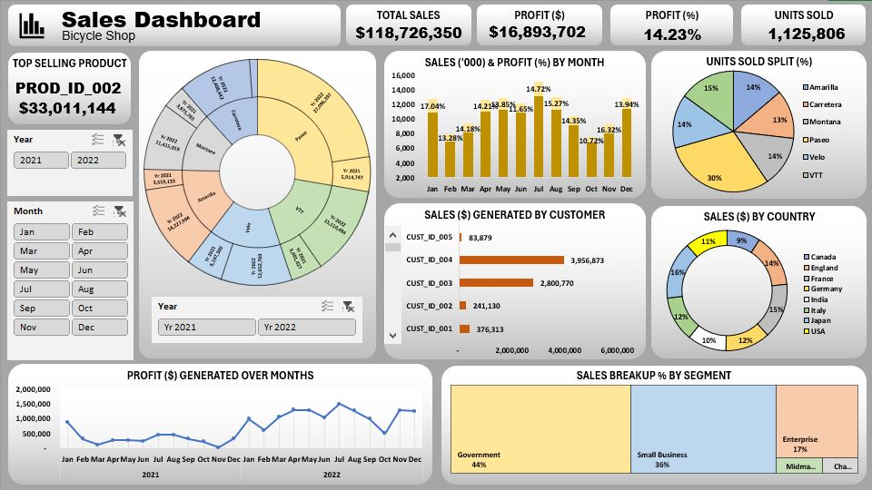

# 🚲 Sales Performance for Bicycle Shop Dashboard

## 📚 About Data
This interactive sales dashboard analyzes over $118M in total sales, $16.9M in profit, and 1.1M units sold, segmented by product, customer, country, and month. It highlights top-performing products (PROD_ID_002), customer contributions, sales by segment, and monthly profit trends across 2021–2022.

## 💡 Highlights

- Top-Selling Product: PROD_ID_002 generated the highest revenue — $33,011,144 in sales.
- Total Sales: The business achieved $118,726,350 in total sales with a 14.23% profit margin.
- Monthly Trends: The highest monthly profit was recorded in June 2022, with noticeable peaks in late 2021 and mid-2022.
- Sales by Country: The USA and India were leading markets, contributing the largest share of sales.
- Customer Segments: Government and Small Business segments made up 80% of total sales, with Government alone contributing 44%.

## ✏️ Data Wrangling
Conducted simple data wrangling and data cleaning:

- Removed rows with missing values
- Cleaned Valuation and Funding columns and cast as float
- Exclude rows with "Unknown" Funding values
- Explode Select Investors column into individual rows for categorical analysis

## 📊 Visualization
- Produced a 1-pager dashboard using Excel.
- Excel dashboard : [Link](https://drive.google.com/uc?export=download&id=1A3GB8K0NfBIUpE0PzM2SLUkuxeDQLmqL)

